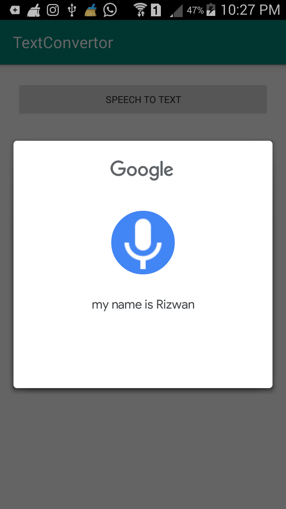
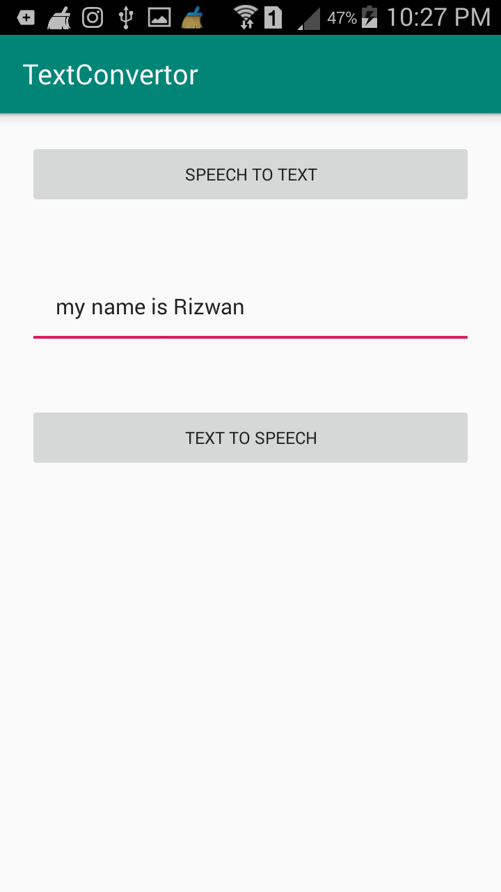

# TextConvertor

Convert Text into Voice(Speech) and Speech into Text.. 

  

<h3> Speech converting into Text <h3>

  
<h3> Text converting into Speech <h3>

<h2> How to add TextConvertor </h2>

<h3> Define maven() into repositories </h3>

        allprojects {
		repositories {
			...
			maven { url 'https://jitpack.io' }
		}
	}
  
 
<h3> Add the dependency </h3> 

	dependencies {
	        implementation 'com.github.sayyedrizwan:TextConvertor:1.4'
	}

<h2> How to use TextConvertor <h2>
  
  <h3> To Convert speech into text </h3>
  
    TextConvertor.speechtoText(context);  // It will activate voice control to get your voice
    
    
    // put full switch case in onActivityResult class to get the output
    
    @Override
    protected void onActivityResult(int requestCode, int resultCode, @Nullable Intent data) {
        super.onActivityResult(requestCode, resultCode, data);

        switch (requestCode){
            case 1:
                if (resultCode == RESULT_OK && null!= data){
                    ArrayList<String> result = data.getStringArrayListExtra(RecognizerIntent.EXTRA_RESULTS);

                    //Get the output of speech
                    editText.setText(result.get(0)); // result.get(0) is the output
                }
                break;
        }

    }

  
  <h3> To Convert text into speech </h3>
  
        TextConvertor.textToSpeech(context, stringoutput);
  

     
    
    
    
